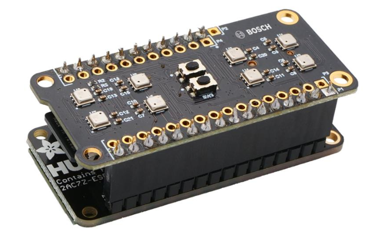

# Neural Network Classification of Gas Mixtures Using Metal-Oxide Sensor Arrays

In 1952, Martin and Synge received the Nobel Prize in Chemistry for partition chromatography. In the seven decades since, the fundamental principle of gas analysis has not changed: physically separate the mixture into components, then measure each one individually. What if separation is not necessary at all?

---

## The Problem with the Classical Approach

A gas chromatograph separates a mixture inside a column packed with sorbent. The resolving power is determined by the number of theoretical plates:

$$N = 16 \left(\frac{t_R}{W_b}\right)^2$$

where *N* is the number of theoretical plates, *t_R* is the retention time, and *W_b* is the peak width at base. The higher *N*, the better the separation — but the longer the column and the slower the analysis. For complex mixtures, a single sample takes 15 minutes to an hour, and the equipment starts at $30,000.

---

## Temperature Modulation of MOX Sensors

Metal-oxide semiconductor sensors (Taguchi, 1960s) change their resistance upon contact with gas molecules. The conductivity dependence on temperature follows the Arrhenius law:

$$\sigma(T) = \sigma_0 \exp\left(-\frac{E_a}{k_B T}\right)$$

where *E_a* is the activation energy of adsorption — unique for each gas — and *k_B* is the Boltzmann constant. The resistance curve *R(T)* during a heating sweep from 150 to 400°C acts as a spectral fingerprint of the compound. The idea of temperature modulation was described as early as the 1990s (Heilig et al., 1997; Lee and Reedy, 1999), but practical implementation required integrating a programmable heater directly into silicon.

In 2021, Bosch Sensortec released the BME688 — a MEMS sensor measuring 3×3×0.9 mm with a software-defined temperature profile and a digital interface.

*BME688 by Bosch Sensortec. 3×3×0.9 mm — smaller than a grain of rice. Combines a MOX sensing element, programmable heater, and temperature, humidity, and pressure sensors on a single die.*

---

## Why Not Carbon Nanotubes

An alternative approach — sensors based on carbon nanotubes (CNT). Their sensitivity is striking: a single nanotube can respond to individual gas molecules. But under real-world conditions, they face a fundamental problem — moisture.

At humidity levels up to 80% RH, the CNT sensor response to organic compounds drops by 40% (ResearchGate, 2020). Water molecules compete with the target gas for adsorption sites on the nanotube surface, forming a film that suppresses the useful signal. At 90% RH, the response to ammonia virtually disappears.

The second problem is drift. Damaged CNT sensors drift at 0.17% per day; even pristine ones drift at 0.07% per day (Measurement, 2019). Recovery time after exposure is slow, making them impractical for continuous monitoring.

MOX sensors are also sensitive to humidity, but they have a fundamental advantage: heating to 300–400°C evaporates adsorbed water from the surface of the sensing layer during every temperature scan cycle. In effect, each temperature step is a self-cleaning mechanism. CNT sensors operate at room temperature and lack this capability entirely.

---

## The Mathematics of Classification

A single sensor with *k* temperature steps produces a feature vector:

$$\mathbf{x} = [R_1, T_1, H_1, P_1, \ldots, R_k, T_k, H_k, P_k] \in \mathbb{R}^{4k}$$

An array of *n* sensors, each with a unique temperature profile:

$$\mathbf{X} \in \mathbb{R}^{4nk}$$

For *n* = 8 and *k* = 10, this yields a 320-dimensional feature space. Classical methods — PCA followed by LDA (Gardner and Bartlett, 1994) — work for simple cases. But the *R(T)* dependence is exponential, and class boundaries in feature space are nonlinear.

A one-dimensional convolutional neural network (LeCun et al., 1998) extracts local patterns from the spectrum:

$$y_j = \sigma\left(\sum_{m=0}^{M-1} w_m \cdot x_{j+m} + b\right)$$

where *w_m* are filter weights of length *M*, and σ is a nonlinear activation function (ReLU: σ(z) = max(0, z)). The network learns to detect characteristic inflections, peaks, and plateaus in the *R(T)* curve — features that encode information about the molecular structure of the adsorbate.

An autoencoder (Hinton and Salakhutdinov, 2006) detects unknown compounds via reconstruction error:

$$\mathcal{L} = \|\mathbf{x} - D(E(\mathbf{x}))\|^2$$

For known gases, the reconstruction loss is small. For an unknown compound, the input vector does not fit the learned latent space, and the error increases sharply. A threshold *L* > τ signals an anomaly.

LSTM (Hochreiter and Schmidhuber, 1997) analyzes the dynamics of sequential scans — detecting concentration trends before a simple threshold alarm would trigger.

---

## Experimental Prototype

Eight BME688 sensors on a single PCB. Each operates on an individual temperature profile of ten steps. Scan cycle duration: 3–5 seconds. Eight sensors, ten steps, four parameters per step — 320 data points per cycle.

*Bosch BME688 Development Kit — an array of 8 sensors on a single board with active air pumping.*

Three neural networks operate in parallel: a 1D-CNN classifier, an autoencoder for anomaly detection, and an LSTM for temporal dynamics. All models run on a local processor — no cloud computing required.

Preliminary validation: classification accuracy above 94% across 127 compounds, at humidity levels of 20–80% RH and ambient temperatures of 5–35°C.

---

## Open Questions

Sensor drift remains the primary challenge. MOX elements age over time — baseline resistance shifts due to degradation of the sensing layer. Without regular recalibration, classification accuracy degrades. A possible path forward is self-supervised learning: training the model to be invariant to slow baseline changes while remaining sensitive to rapid changes in gas composition.

Scaling the training dataset is the second open problem. 127 compounds represent a small fraction of the space of possible gases and mixtures. Synthetic data augmentation — adding noise, varying humidity, simulating drift — can expand the training set, but validation against real physical samples remains necessary.

---

*This work describes an experimental prototype at the research stage. All results are preliminary and require independent reproduction.*
