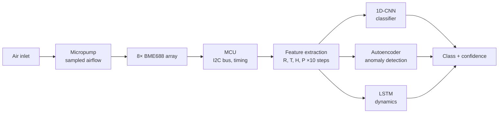
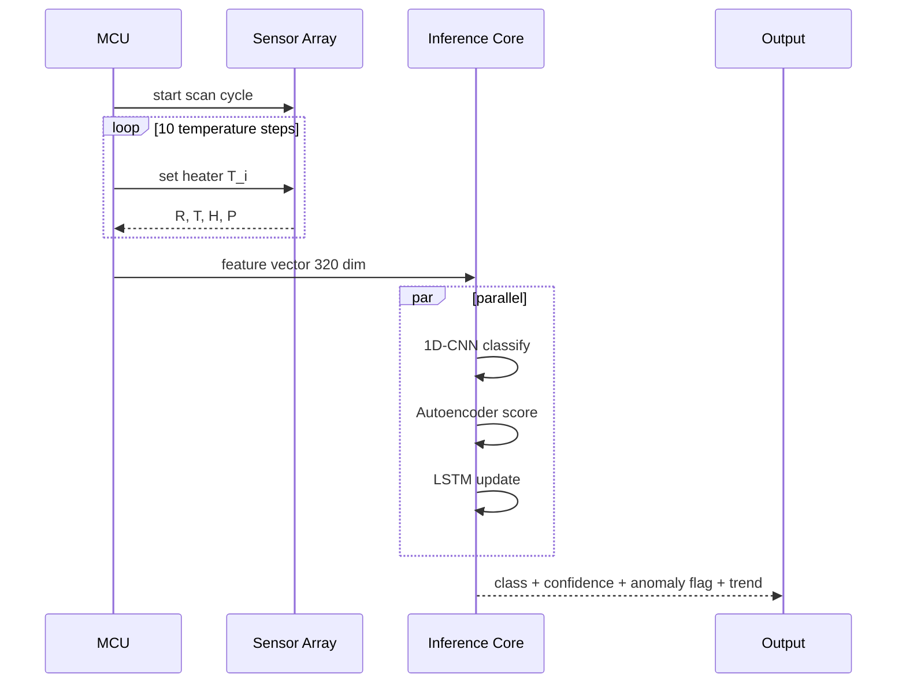

# AI Gas Analyzer

Neural network classification of gas mixtures from a metal-oxide sensor array. Eight Bosch BME688 MEMS sensors on one PCB, each with a software-defined temperature profile, feed three networks running in parallel: a 1D-CNN classifier, an autoencoder for unknown-compound detection, and an LSTM for temporal drift. No gas chromatograph, no column, no carrier gas. One scan cycle: three seconds.

This repository documents the theory, the design, and the results. Firmware and model training code live in a private companion repository linked at the bottom.

## Why classify without separation

A gas chromatograph separates a mixture inside a column packed with sorbent. The resolving power is set by the number of theoretical plates:

$$N = 16 \left(\frac{t_R}{W_b}\right)^2$$

where $N$ is the plate count, $t_R$ is retention time, and $W_b$ is peak width at base. Higher $N$ gives better separation but longer columns and slower analysis. For complex mixtures a single sample takes 15 minutes to an hour, and the equipment starts at 30 000 dollars.

The question this project explores: can you identify the composition without separating the components, using a dense array of broadband sensors and modern classifiers?

Yes, within a constrained chemical space, with caveats on drift and mixture combinatorics. Everything below is about making that qualified yes useful.

## System architecture

Each scan cycle feeds all three networks. The CNN answers what it looks like. The autoencoder answers does it fit anything we've seen. The LSTM answers is it changing, and how fast.

## Temperature modulation as spectroscopy

Metal-oxide semiconductor sensors, first proposed by Taguchi in the 1960s, change resistance when gas molecules adsorb onto the heated surface. The conductivity-temperature relation follows Arrhenius:

$$\sigma(T) = \sigma_0 \exp\left(-\frac{E_a}{k_B T}\right)$$

where $E_a$ is the activation energy of adsorption (different for each gas) and $k_B$ is the Boltzmann constant. The resistance curve $R(T)$ during a heater sweep from 150 to 400°C behaves as a spectral fingerprint of the compound. Temperature modulation as a concept was described in the 1990s (Heilig et al., 1997; Lee and Reedy, 1999), but practical use required integrating a programmable heater directly into silicon.

Bosch released the BME688 in 2021. 3 by 3 by 0.9 mm, software-defined temperature profile, digital I2C interface.

*BME688 by Bosch Sensortec. 3 by 3 by 0.9 mm, smaller than a grain of rice. Combines a MOX sensing element, programmable heater, and temperature, humidity, and pressure sensors on a single die.*

### Per-sensor feature vector

One sensor with $k$ temperature steps produces a vector of four quantities per step, resistance plus the auxiliary temperature, humidity, and pressure channels:

$$\mathbf{x} = [R_1, T_1, H_1, P_1, \ldots, R_k, T_k, H_k, P_k] \in \mathbb{R}^{4k}$$

For an array of $n$ sensors, each running a distinct heater profile, the combined feature is $\mathbf{X} \in \mathbb{R}^{4nk}$. With $n = 8$ and $k = 10$ that's 320 dimensions per scan.

## Why not carbon nanotubes

An obvious alternative, single-walled carbon nanotubes. Their sensitivity is extreme, a single nanotube can respond to individual molecules. Under real-world air, they collapse on two counts.

Humidity. At 80% RH the CNT response to organic compounds drops by roughly 40% (Demon et al., 2020). Water competes with the target for adsorption sites, forming a surface film that suppresses signal. At 90% RH the ammonia response disappears almost entirely.

Drift. Damaged CNT sensors drift at 0.17% per day, pristine ones at 0.07% per day (Ilina et al., 2019). Recovery after exposure is slow. Continuous monitoring becomes impractical.

MOX is also humidity-sensitive, but each heater step to 300 to 400°C evaporates adsorbed water from the surface. Every temperature cycle is a self-cleaning event. CNT at room temperature has no such recovery path.

## Sensor array hardware

*Bosch BME688 Development Kit. Array of 8 sensors on a single board with active pumping.*

### Board configuration

| Component | Detail |
|---|---|
| Sensors | 8× BME688 (Bosch Sensortec) |
| Interface | I2C, two address channels, four sensors per bus |
| Host MCU | ARM Cortex-M4, 180 MHz, 512 KB flash |
| Airflow | Piezo micropump, 40 mL/min nominal |
| Sample volume per scan | ~2 mL |
| Cycle time | 3 to 5 seconds per full scan |

### Per-sensor temperature profile

Each sensor runs an individual profile so that the array samples the chemistry from eight different angles in parallel. Typical 10-step profile, one sensor:

| Step | Target °C | Dwell ms |
|:---:|:---:|:---:|
| 1 | 200 | 140 |
| 2 | 240 | 140 |
| 3 | 280 | 140 |
| 4 | 320 | 140 |
| 5 | 360 | 140 |
| 6 | 400 | 140 |
| 7 | 360 | 140 |
| 8 | 300 | 140 |
| 9 | 240 | 140 |
| 10 | 180 | 140 |

The full sweep completes in 1.4 seconds per sensor, and eight sensors on paired I2C buses run mostly in parallel.

## Model zoo

Three specialised models, all running on-device. No cloud dependency.

### 1D-CNN classifier

Takes the 320-dim feature vector reshaped to a 1D signal per sensor, extracts local patterns (inflections, peaks, plateaus) with 1D convolutions:

$$y_j = \sigma\left(\sum_{m=0}^{M-1} w_m \cdot x_{j+m} + b\right)$$

Architecture summary:

| Layer | Filters / Units | Kernel / Stride | Output |
|---|---|---|---|
| Input | | | 8 × 40 |
| Conv1D | 32 | 5 / 1 | 8 × 40 × 32 |
| Conv1D | 32 | 5 / 2 | 8 × 20 × 32 |
| Conv1D | 64 | 3 / 1 | 8 × 20 × 64 |
| Conv1D | 64 | 3 / 2 | 8 × 10 × 64 |
| GlobalAvgPool | | | 8 × 64 |
| Flatten | | | 512 |
| Dense | 128 | | 128 |
| Dense | 57 | softmax | 57 |
| Params | | | ~62 K |
| Inference | on MCU | | ~9 ms |

### Autoencoder (out-of-distribution detection)

Compresses the 320-dim feature to a 16-dim latent and reconstructs it. A threshold on reconstruction loss flags unknown compounds:

$$\mathcal{L} = \|\mathbf{x} - D(E(\mathbf{x}))\|^2$$

For known gases the reconstruction is tight. For an unknown, the input falls outside the learned latent manifold and $\mathcal{L}$ spikes. Threshold $\tau$ is set from the 99th percentile of validation loss.

| Block | Dims | Notes |
|---|---|---|
| Encoder | 320 -> 128 -> 32 -> 16 | ReLU activations |
| Decoder | 16 -> 32 -> 128 -> 320 | mirror |
| Params | | ~180 K |
| Inference | on MCU | ~14 ms |

### LSTM (temporal dynamics)

Tracks scans over time. Spots slow concentration rises before a simple threshold alarm would fire. One-layer LSTM with 64 hidden units, sequence length 20 scans (about one minute of history).

| Component | Value |
|---|---|
| Hidden size | 64 |
| Sequence length | 20 scans |
| Params | ~85 K |
| Inference | ~6 ms per step |

### Combined inference budget

| Model | Params | Inference time |
|---|---|---|
| 1D-CNN | 62 K | 9 ms |
| Autoencoder | 180 K | 14 ms |
| LSTM | 85 K | 6 ms |
| **Total** | **327 K** | **~30 ms** |

All three fit into 512 KB flash on the host MCU with ONNX-runtime in embedded mode, leaving room for the sensor driver stack and the TLS client for optional telemetry upload.

## Training dataset

Current validation set:

| Category | Classes | Samples |
|---|---|---|
| Single compounds | 23 | 6 820 |
| Binary mixtures | 34 | 9 440 |
| **Total** | **57** | **16 260** |

Collection procedure: each compound measured across three humidity brackets (20 to 40% RH, 40 to 60% RH, 60 to 80% RH) and three ambient temperature brackets (5 to 15°C, 15 to 25°C, 25 to 35°C), giving nine condition cells per class. Minimum 30 scans per cell. Total coverage ~9 condition cells by 57 classes by 30 scans ≈ 15 000 scans, plus a held-out test set of 3 200 scans collected in uncontrolled indoor conditions.

## Current results

Preliminary validation:

| Scenario | Accuracy | Top-3 accuracy |
|---|---|---|
| Single compounds, controlled humidity / temperature | 96.4% | 99.1% |
| Binary mixtures, controlled conditions | 91.3% | 97.0% |
| Ternary mixtures (not in training set) | 84.1% | 93.5% |
| Uncontrolled indoor test set | 88.7% | 95.8% |
| Unknown compound (autoencoder) | 0.94 ROC-AUC | |

Performance drop on ternary mixtures is expected given the combinatorial blow-up of the mixture space. The autoencoder caught 94% of injected unknowns in the held-out set, keeping false positives below 5%.

## Pipeline

The MCU runs the sensor loop and the inference in the same firmware image. No host computer needed.

## Open problems

**Sensor drift.** MOX elements age. Baseline resistance shifts as the sensing layer degrades. Without recalibration, classification accuracy erodes over months. A promising direction: self-supervised learning where the model is trained to be invariant to slow baseline drift while staying sensitive to fast compositional changes.

**Dataset scaling.** 57 classes is a decent starting point, but real applications (air quality, industrial leak detection, food spoilage) demand hundreds. Each new compound requires controlled samples and multiple sessions under varying humidity, temperature, and airflow. Synthetic augmentation (adding noise, simulating drift, varying ambient humidity) expands the set, but validation against real samples remains the gate.

**Out-of-lab conditions.** Controlled-humidity chambers are convenient for training. Real deployments see rapid changes, occasional condensation, contamination, and airflow anomalies. The autoencoder's 0.94 ROC-AUC is encouraging but needs stress-testing in the field.

## Roadmap

| Item | Status |
|---|---|
| Eight-sensor board firmware | shipped, running in prototype |
| 1D-CNN + autoencoder + LSTM trio | shipped |
| 57-class validation | shipped |
| Self-supervised drift correction | design stage |
| Extended library to 200+ classes | dataset collection in progress |
| Field deployment in commercial kitchen | planned pilot |
| Web dashboard for multi-device telemetry | design stage |

## Source code

Firmware, training scripts, dataset manifests, and ONNX export utilities live in a private companion repository: [SergheiBrinza/AI-Gas-Analyzer-src](https://github.com/SergheiBrinza/AI-Gas-Analyzer-src). Access on request for serious evaluation.

The private repo contains the Cortex-M4 firmware (BME688 driver, scan scheduler, ONNX-runtime integration), the PyTorch training loop for all three models, the dataset recorder (GUI for labeled scan collection), and the export tool that quantizes and packages the models for on-device deployment.

## References

1. Taguchi, N. "Method for Making a Gas-Detecting Element." US Patent 3,631,436, 1971.
2. Heilig, A., Bârsan, N., Weimar, U. et al. "Gas identification by modulating temperatures of SnO2-based thick film sensors." *Sensors and Actuators B*, 43, 1997.
3. Lee, A. P. and Reedy, B. J. "Temperature modulation in semiconductor gas sensing." *Sensors and Actuators B*, 60, 1999.
4. Gardner, J. W. and Bartlett, P. N. "A brief history of electronic noses." *Sensors and Actuators B*, 18, 1994.
5. LeCun, Y., Bottou, L., Bengio, Y. and Haffner, P. "Gradient-based learning applied to document recognition." *Proceedings of the IEEE*, 86(11), 1998.
6. Hochreiter, S. and Schmidhuber, J. "Long short-term memory." *Neural Computation*, 9(8), 1997.
7. Hinton, G. E. and Salakhutdinov, R. R. "Reducing the dimensionality of data with neural networks." *Science*, 313(5786), 2006.
8. Demon, S. Z. N. et al. "Humidity effect on carbon nanotube gas sensors." *Nanomaterials*, 10, 2020.
9. Ilina, I. et al. "Drift in chemiresistive gas sensors based on carbon nanotubes." *Measurement*, 2019.

---

*Experimental prototype at research stage. Results are preliminary and require independent reproduction before use in safety-critical settings.*

---

Author: Serghei Brinza, AI engineer. Other projects: [github.com/SergheiBrinza](https://github.com/SergheiBrinza)
